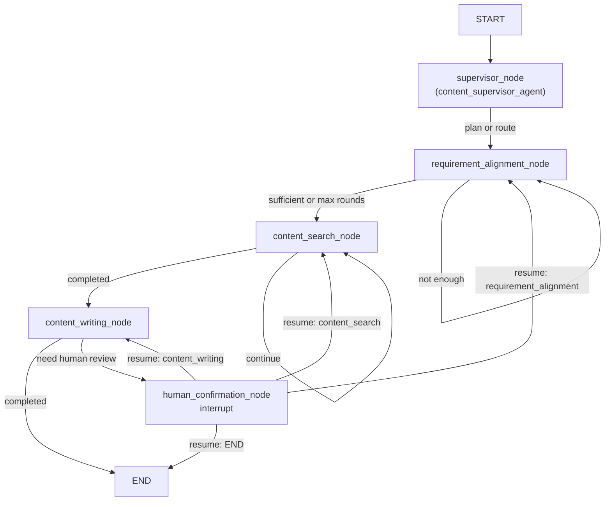
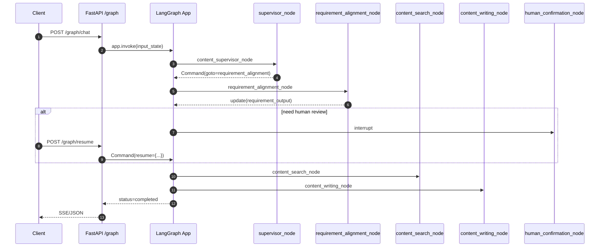

### 01 设计模式与整体架构（参考答案）

- 关键参考: `agents/graph/**`, `apis/**`, `utils/**`, `config/**`, `core/**`
- 目标：解释项目分层、架构决策、设计模式选型与演进策略，并能落地到具体文件与运行路径。

### 一、分层与依赖方向
- apis 层（FastAPI 网关）
  - 职责：HTTP 接入、鉴权/中间件、SSE 流式输出、错误转换与限流。入口文件如 `apis/app.py`, `apis/routes.py`, `apis/graph_routes*.py`。
  - 依赖：向下依赖 agents 的已编译图（Graph）、utils 的通用能力与 config 的配置。
- agents 层（智能体与编排）
  - 职责：多智能体定义（`agents/graph/agent/*`）、节点封装（`agents/graph/node/*`）、工作流装配（`agents/graph/workflows/*`）、检查点存储（`agents/graph/redis_checkpoint.py`）。
  - 依赖：LangGraph/LangChain 仅在此层（含工具层）使用，最大限度与业务/基础设施解耦。
- utils 层（通用基础设施）
  - 职责：日志、数据库/向量检索、外部 API 客户端、鉴权、缓存/速率限制、文件/对象存储等。
  - 依赖：仅向下依赖第三方 SDK，不反向依赖 agents，避免环形依赖。
- config 与 core 层
  - 职责：集中配置（`.env.*` + `config/*.yaml` + `config_manager.py`）、上下文/日志初始化（`core/context.py`, `core/log_config.py`）。

解耦收益：将 `langchain/langgraph` 使用收敛到 agents + tool 层，确保业务与基础设施可独立演进与替换；单测/集成测试边界清晰；生产事故定位更快。

### 二、关键架构决策（StateGraph 与检查点）
- 为什么选择 LangGraph `StateGraph`
  - 显式 DAG 与条件路由，语义清晰，便于观测和测试；对比事件总线更容易做断点恢复与确定性重放。
  - 原生支持 `interrupt/resume` 与 `checkpointer`，天然适配人审在环（human-in-the-loop）。
- 检查点策略
  - 内存版：`MemorySaver`，适合开发与轻量任务；
  - Redis 版：`AsyncRedisSaver`（`agents/graph/redis_checkpoint.py`），支持多实例水平扩展与跨进程恢复；
  - 原则：保存“最小可恢复状态”，避免重复外部副作用；恢复后需有“幂等键”保护可重放节点。

### 三、设计模式落地
- 策略模式（Strategy）
  - 场景：多 LLM 厂商/多模型切换。通过 `utils/llm_client*.py` 或 `utils/llm_client_factory.py`（若有）按配置选择不同实现；统一接口：`generate`, `stream`, `count_tokens`。
- 适配器模式（Adapter）
  - 场景：第三方 API（Milvus/XHS/Web Search）适配为 LangChain 工具。`agents/graph/tool/**` 使用 `@tool` 将 Python 函数暴露为统一 schema，供 `create_react_agent` 注入。
- 外观模式（Facade）
  - 场景：`apis/` 作为对外门面，屏蔽鉴权、路由、SSE、异常映射；对上只暴露 REST/Stream，对下仅依赖编译后的 Graph。
- 构建者模式（Builder）
  - 场景：提示词与上下文装配。`prompts/**`, `utils/loomi_context_builder.py` 负责规范化构建，支持模板化、变量注入与复用。
- 仓储模式（Repository）
  - 场景：`utils/database/**` 隔离存储细节（SQL/向量/文件），领域层不感知具体驱动，便于迁移与压测。

### 四、模块职责与联系（以内容写作为例）
- `workflows/content_writing_graph.py`：声明 `StateGraph`，注册节点与条件边，提供 `compile_*_with_*`（注入 Memory/Redis 检查点）。
- `node/*`：将 Agent 调用/工具编排封装为可复用节点；`supervisor_node` 负责决策与路径控制。
- `agent/*`：使用 `create_react_agent(model, tools)` 实例化智能体；工具由 `tool/*` 注入。
- `tool/*`：如 `xhs_search`、`vector_search`，通过 `@tool` 暴露调用入口；部分带并发控制与代理透传。
- `apis/graph_routes*.py`：HTTP 层将请求/会话封装为 Graph 的输入；提供流式结果与 `Command(resume=...)` 恢复。

### 五、架构权衡与演进
- DAG vs 事件驱动：本项目偏向确定性与可恢复，优先 DAG；若后续需要松耦合大规模协作，可在边界层引入事件总线（如 Kafka）承载部分异步任务。
- 幂等与补偿：所有“产生外部副作用”的节点（写库、发消息、对象存储）需引入幂等键；失败时通过补偿事务（删除/回滚/标记）恢复一致性。
- 横向扩展：无状态 apis/agents Pod + 共享 Redis/Milvus；合理的连接池、速率限制与熔断策略；队列化限流避免级联故障。
- 配置治理：环境变量注入机密，YAML 管理业务参数；提供“热更新钩子 + 版本标记 + 回滚机制”。

### 六、实操走查要点
- `content_writing_graph.py`：
  - `StateGraph(ContentWritingState)` → `add_node` → `add_edge(START, ...)` → `add_conditional_edges(...)`；
  - `compile_content_writing_with_memory/redis()`：构建检查点器并 `graph.compile(checkpointer=..., debug=True)`。
- `supervisor_node.py` 与 `supervisor_agent.py`：
  - node 中调用 agent 的 `ainvoke`，根据返回信号/标签选择下一跳；
  - agent 通过工具与模型交互，产出结构化决策（如下一步任务/结束）。

### 七、观测与治理（加分项）
- Tracing：在 apis/agents 工具调用入口加统一拦截器，记录 trace/span；对 LLM/外部 API 统计耗时分布与错误率。
- 速率/熔断：对敏感外部依赖设置并发上限与退避重试；提供全局熔断与降级返回。

### 八、面试加深追问
-
### 附录：关键代码片段与流程图

- Supervisor 路由节点（节选）：
```12:21:agents/graph/node/supervisor_node.py
async def content_supervisor_node(state: ContentWritingState) -> Command:
    current_stage = state.get("current_stage", "requirement_alignment")
    if not state.get("workflow_plan"):
        supervisor_result = await content_supervisor_agent.ainvoke({...})
        updated_state = {..., "current_stage": "requirement_alignment"}
        return Command(goto=[Send("requirement_alignment", updated_state)])
```

- 工作流装配（节选）：
```20:37:agents/graph/workflows/content_writing_graph.py
graph = StateGraph(ContentWritingState)
graph.add_node("supervisor", content_supervisor_node)
graph.add_node("requirement_alignment", requirement_alignment_node)
graph.add_node("content_search", content_search_node)
graph.add_node("content_writing", content_writing_node)
graph.add_node("human_confirmation", human_confirmation_node)
graph.add_edge(START, "supervisor")
graph.add_conditional_edges("human_confirmation", route_after_confirmation, {..., "END": END})
```

- Mermaid 流程图（高层）：


- Mermaid 时序图（API→Graph）：


- PNG 导出（可选）：`interview/diagrams/png/architecture_flow.png`, `interview/diagrams/png/api_sequence.png`

### 样例回答/评分标准
- 样例回答要点：
  - 清晰说明分层与依赖方向，强调 `langchain/langgraph` 收敛在编排与工具层；
  - 解释选用 StateGraph 的原因（确定性、可观测、可恢复）与检查点策略；
  - 举例说明策略/适配器/外观/构建者/仓储在本项目的落地文件与收益；
  - 给出幂等与补偿、热更新、扩展与降级方案，并指出观测位点。
- 评分标准：
  - 优秀：覆盖设计权衡、工程化治理、可靠性与可观测，能引用具体文件/代码行；
  - 合格：描述主要模式与动机，能画出高层流程与关键节点；
  - 待提高：仅泛化描述，缺少与本项目的具体关联。

### 参考答案（示例）
- 分层边界：
  - apis 仅负责 HTTP 接入、SSE、鉴权、错误映射；不包含业务决策；
  - agents 负责多智能体实例化、工具注入、编排图声明与编译；
  - utils 提供通用能力（数据库/向量库/日志/鉴权/缓存等）；
  - config/core 负责配置/上下文/日志初始化；
  - 依赖倒置：apis→agents→utils，不反向引用，避免环；
- 选用 StateGraph 的原因：
  - 显式 DAG + 条件边，利于可观测与测试；
  - 原生支持 interrupt/resume 与 checkpointer，HITL 成本低；
  - 与 LangChain 工具生态无缝；
- 关键设计模式落地：
  - Strategy：多 LLM 客户端切换（`utils/llm_client*.py`）；
  - Adapter：`@tool` 将第三方 API 包装为 LangChain 工具；
  - Facade：`apis` 统一路由/中间件/错误处理；
  - Builder：`prompts/**` 与上下文构建器聚合变量；
  - Repository：`utils/database/**` 隔离存储细节；
- 检查点策略：
  - 开发态 `MemorySaver`，生产态 `AsyncRedisSaver`；保存“最小可恢复状态 + 路由位点”；
  - 恢复后仅重放无副作用节点，写外部副作用节点加幂等键（请求哈希/业务键）与补偿；
- 扩展与演进：
  - 新增能力：新增 tool + 在目标 agent 工具列表注册 + 在 workflow 中接线；
  - 配置热更新：通过 env/yaml + reload 钩子切换模型/温度/阈值，记录版本并可回滚；

### 常见错误与改进建议
- 错误：业务代码直接依赖 LangChain/LangGraph，导致强耦合。
  - 改进：将框架依赖收敛到 `agents/graph/**` 与 `agents/graph/tool/**`，其余层通过接口交互。
- 错误：编排图隐式依赖与隐式状态字段，后期难以维护。
  - 改进：统一状态命名空间与字段规范，路由与结束条件显式化，关键节点画图沉淀。
- 错误：检查点保存过大对象/冗余数据，恢复缓慢。
  - 改进：仅保存“最小可恢复状态”，大对象存储引用，恢复后按需拉取。
- 错误：新增能力时跨层改动多点，回归范围难控。
  - 改进：新增功能遵循“tool→agent→workflow”最小闭环，禁止直接修改 apis/utils 的核心契约。
- 更多图示见 `interview/diagrams/architecture_flow.md` 与 `interview/diagrams/api_sequence.md`。
- 如何在保持“依赖收敛”的前提下引入 MCP 工具？答：在工具层通过适配器接入，再由 `create_react_agent` 注入，避免波及业务层。
- 若替换 LangGraph 为自研编排，哪些边界需要抽象？答：Graph 接口、节点生命周期、检查点协议与可观测性 SPI。