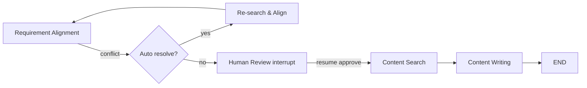

### 02 多 Agent 协作机制（参考答案）

- 关键参考: `agents/graph/node/**`, `agents/graph/agent/**`, `agents/graph/workflows/**`, `apis/graph_routes*.py`

### 一、角色与边界
- Supervisor（规划/仲裁）
  - 输入：用户需求、历史上下文、外部信号（人审/超时等）。
  - 输出：子任务列表、路由决策（下一节点）、收敛条件（何时结束）。
- Requirement Alignment（需求澄清）
  - 输入：原始需求或草案；输出：结构化需求与验收标准（领域、风格、长度、禁忌）。
- Content Search（检索）
  - 输入：主题/关键词；输出：证据集合（相关文章、要点、链接、向量召回结果）。
- Content Writing（写作）
  - 输入：结构化需求+证据；输出：草稿与理由（支持链）。
- Human Confirmation（人类在环）
  - 输入：草稿/待确认条目；输出：修改意见/确认信号。通过 `interrupt` 暂停图，待前端回填后 `resume`。

### 二、Planner-Subagent 运行细节
- 任务拆解：Supervisor 根据需求模板将任务拆为可执行子任务（澄清→检索→写作→复核），并标注必要输入/输出与依赖边。
- 工具注入：各子 Agent 基于 `create_react_agent(model, tools)` 注入特定工具（如检索/向量库/XHS）。
- 完成判定：Supervisor 维护“完成条件”（如 all required slots filled + human ok）；当满足时路由至 END。
- 自我修正：对子 Agent 返回的低置信结果，Supervisor 可回退到“再澄清/再检索”路径，形成环路但有步数上限。

### 三、状态隔离、合并与冲突
- 隔离：各子 Agent 仅写入命名空间化字段（如 `state.search.evidence[]`, `state.req.spec`），避免覆盖。
- 合并：定义合并器（时间序优先/来源权重/显式仲裁）；对冲突标注 `conflicts[]` 并触发仲裁流程。
- 冲突处理：
  1) 自动：触发再检索+证据对齐；
  2) 半自动：标注冲突点，提示人审；
  3) 策略：来源可信度>时间新鲜度>多源投票。

### 四、中断与恢复（HITL）
- 触发：在需要用户确认处 `interrupt`；
- 恢复：前端提交修改后，后端在 `apis/graph_routes*.py` 调用 `Command(resume=...)` 继续执行；
- 幂等：恢复后仅重放“可重放节点”，对外部副作用节点需幂等键保护。

### 五、可恢复与一致性（Checkpoint）
- MemorySaver：轻量、开发态；
- AsyncRedisSaver：生产可用，支持跨实例恢复；
- 记录内容：最小可恢复状态+路由位置+必要上下文快照；
- 重放策略：对 LLM 调用通常允许重放（无副作用），对写库/发消息需要幂等护栏或补偿。

### 六、并行化与调度
- 并行化：可将“检索与需求澄清的部分步骤”并行；合并器在 join 点裁决；
- 资源保护：为外部依赖（Redis/Milvus/外部 API）设置并发上限/速率限制；工具级并发控制示例见 `xhs_search/concurrency_control.py`。

### 七、观测与治理
- 关键指标：子任务平均耗时、失败率、重试分布、冲突率与人审插入率；
- 调参与灰度：对单 Agent 支持独立开关/阈值/Prompt 模板灰度，降低联动风险。

### 八、示例走查
- `supervisor_node.py`：`content_supervisor_agent.ainvoke` 返回结构化路由信号，节点据此 `Send/Command` 到下一步；
- `graph_routes*.py`：封装 SSE 与 `resume`，维护上下文 ID 与恢复点。

### 附录：代码与图示

- Supervisor 决策（节选）：
```73:91:agents/graph/node/supervisor_node.py
if current_stage in ["requirement_alignment", "alignment"]:
    is_sufficient = requirement_output.get("is_sufficient", False)
    if is_sufficient or round_count >= 3:
        updated_state = {..., "current_stage": "content_search"}
        return Command(goto=[Send("content_search", updated_state)])
    else:
        return Command(goto=[Send("requirement_alignment", state)])
```

- Mermaid：冲突处理与人审回路（示意）


- 补充图稿：`interview/diagrams/agent_conflict_hitl.md`。

### 样例回答/评分标准
- 样例回答要点：
  - Planner-Subagent 的任务分解/完成判定与人审回路；
  - 状态隔离（命名空间字段）与合并策略（时间/可信度/仲裁）；
  - 中断/恢复/幂等的协同与可重放边界；
  - 并行化、资源保护与冲突回退策略。
- 评分标准：
  - 优秀：能将协作细节映射到具体节点与状态字段，提供合并/仲裁规则；
  - 合格：能讲清协作流程与人审机制；
  - 待提高：停留在概念描述，无落地细节。

### 常见错误与改进建议
- 错误：所有子 Agent 写入同一字段，互相覆盖。
  - 改进：为各阶段划分命名空间字段并只写自己负责的区块。
- 错误：冲突只做“最后写入覆盖”，导致结果丢失。
  - 改进：引入合并器，保存冲突详情，按可信度/时间/投票裁决。
- 错误：恢复后重复调用外部副作用步骤。
  - 改进：无副作用可重放，外部副作用需要幂等键与补偿事务。
- 错误：并行分支无限扩散，引发资源雪崩。
  - 改进：设置并发与递归上限，按租户/用户配额限制；对外依赖限流与熔断。