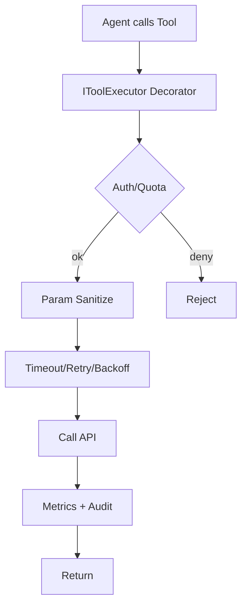

### 04 工具调用与 API 注入机制（参考答案）

- 关键参考: `agents/graph/agent/**`, `agents/graph/tool/**`, `agents/graph/node/**`

### 一、工具定义与动态注册
- 定义：使用 `langchain_core.tools.@tool` 装饰 Python 函数，基于签名与（可选）Pydantic 注解生成工具的 JSON Schema（名称、描述、参数类型、必填项等）。
- 注册：在各 `*_agent.py` 中通过 `create_react_agent(model, tools=[...])` 注入；新增一个工具仅需：
  1) 在 `agents/graph/tool/` 下实现函数并加 `@tool`；
  2) 在对应 Agent 实例化时加入 tools 列表；
  3) 为工具提供人类可读的 `description` 与典型用例提示，提升模型选工具的命中率。

### 二、工具选择与参数对齐
- 工具选择：模型依据 `description`、历史示例、上下文语义进行选择；可通过“工具描述增强+少样本示例”引导；高风险工具应增加“确认提示”。
- 参数对齐：
  - Pydantic/注解用于类型校验；
  - 枚举/范围参数在描述中明确，必要时在工具内部做兜底校验并返回结构化错误；
  - 对复杂 JSON/URL 参数，提供 helper（示例/模板）并在失败时返回“可恢复的”错误，便于模型二次修正。

### 三、失败回退与重试
- 类别回退：同类工具（多搜索源/多模型）可作为备用；采用“主→备→兜底”顺序，并限制总重试时长；
- 退避重试：指数退避 + 抖动，区分可重试（超时/限流）与不可重试（4xx 参数错误/权限）错误；
- 结果健康度：标准化返回结构（success/msg/data），失败可附带“修复建议”，方便上层 Agent 进行补救。

### 四、并发与限流（XHS 示例）
- 并发控制：`xhs_search/concurrency_control.py` 基于 `threading.Semaphore` 实现：每 Cookie（a1 标识）最大 2 并发，全局最大 10；
- 原因：小红书反爬严格，需限制同账号并发与全局并发避免触发风控；
- 代理透传：工具接口统一接受 `proxies`，通过 `requests` 传递；
- 观测：记录等待时长与获得令牌的时间分布，辅助限流参数调优。

### 五、统一执行抽象（建议）
- IToolExecutor（装饰器/代理类）职责：
  - 鉴权与配额：按用户/租户/环境控制；
  - 审计：入参/出参/耗时/错误；
  - 稳定性：超时、重试、熔断、降级；
  - 参数清洗：URL/JSON 规范化与敏感字段脱敏；
  - 指标：通过 hook 输出至日志/Tracing/指标系统（如后续接 Prometheus）。

### 六、观测与追踪
- Tracing：在工具入口加统一拦截器生成 span，标注模型/工具名/参数摘要/下游延迟；
- 指标：QPS、成功率、P95、重试率、熔断触发次数；
- 日志：结构化（trace_id, tool_name, args_hash, duration_ms, error_class, retry_count）。

### 七、代码走查（XHS）
- `xhs_utils/xhs_util.py`：ExecJS 读取 `static/*.js` 计算 X-s/X-t/x-s-common 与 traceid；
- `apis/xhs_pc_apis.py`：统一 `generate_request_params` 构造头与 cookies，再用 `requests` 请求；
- `tool/*.py`：`@tool + with_concurrency_control` 对外暴露，返回 JSON 字符串，便于 LLM 解析。

### 八、作业（落地实践）
- 为向量搜索与 WebSearch 工具加入 IToolExecutor：统计耗时分布 + 错误率 + 熔断与退避重试；
- 对“写外部副作用”的工具加入幂等键（如依请求哈希），避免重放导致重复写。

### 附录：代码与图示

- 工具定义（节选）：
```19:33:agents/graph/tool/xhs_search/search_notes.py
@tool
@with_concurrency_control
def search_notes(keyword: str, cookie: str, page: int = 1, sort: int = 0, ... ) -> str:
    ensure_project_path()
    from apis.xhs_pc_apis import XHS_Apis
    api = XHS_Apis()
    success, msg, res_json = api.search_note(...)
    return json.dumps(res_json or {"success": success, "msg": msg}, ensure_ascii=False)
```

- Agent 工具注入（节选）：
```220:258:agents/graph/agent/content_writing_agent.py
llm = ChatOpenAI(...)
content_writing_agent = create_react_agent(
  model=llm,
  tools=[plan_content_creation, create_content_variant, review_and_optimize_content, generate_content_package],
  prompt=..., name="content_writing",
)
```

### 最小可运行示例（curl）
- 触发图流程（流式）：
```bash
curl -N -X POST \
  http://localhost:8000/graph_v2/chat/stream \
  -H 'Content-Type: application/json' \
  -d '{"user_id":"u1","session_id":"s1","query":"写一篇关于榴莲的种草文","enable_human_review":false}'
```

### 参考答案（示例）
- 工具定义与动态注册：使用 `@tool` 自动生成 schema，运行时通过 `create_react_agent(model, tools=[...])` 注入，新增工具最小改动面为“新增函数 + 装饰 + 列表注册”。
- 工具选择：通过高质量 `description`、典型用例 Few-Shot、成本/风险提示，引导模型选对工具；对高危工具启用“人审/确认”提示词约束。
- 参数对齐：Pydantic/注解做类型约束；复杂 JSON/URL 在工具内做二次校验并返回“可恢复的结构化错误”，便于模型二次修正；必要时提供参数模板。
- Fallback 策略：为同类工具定义回退链（主→备→兜底），区分可重试/不可重试错误；指数退避 + 抖动，限制最大重试时长与次数。
- 并发与限流：对敏感外部依赖与反爬目标（如 XHS）采用“Cookie 级 + 全局级”双层限流；对下游 4xx/429/5xx 做退避与熔断。
- 统一执行抽象：用 IToolExecutor（装饰器/代理类）统一实现鉴权/配额、超时/重试/熔断、参数清洗、结构化日志、trace/span 与 metrics。
- 可观测性：在工具入口埋点，记录耗时分布、错误率、QPS、重试次数；按工具/版本维度出看板与告警阈值。

### 常见错误与改进建议
- 错误：工具描述含糊，模型经常选错工具。
  - 改进：加强 `description` 与 Few-Shot，加入代价/风险提示，必要时加入显式确认。
- 错误：复杂参数未校验，导致 4xx 持续发生。
  - 改进：Pydantic/模式校验 + 结构化错误；提供参数模板与二次修正路径。
- 错误：对外部依赖无限重试，放大故障。
  - 改进：区分可重试/不可重试，指数退避 + 最大时长，与熔断联动。

- Mermaid：工具执行拦截器建议


- 补充图稿：`interview/diagrams/tool_executor.md`。