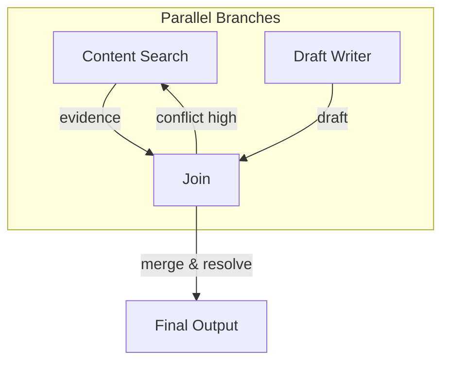

### 05 控制流与调度能力（参考答案）

- 关键参考: `agents/graph/workflows/**`, `apis/graph_routes*.py`, `agents/graph/node/**`

### 一、DAG 能力与路由
- 节点声明：`StateGraph(StateType)` → `add_node(name, fn)`；
- 连边：`add_edge(START, first)` 与 `add_conditional_edges(node, router, mapping)` 实现条件路由；
- 结束：路由至 `END`；支持 `interrupt` 在任意节点挂起，由前端回填后 `resume`。

### 二、幂等与可重放
- 幂等键：对写外部副作用的节点（写库/消息/对象存储）引入请求哈希或业务唯一键；
- 可重放：检查点恢复后，重放仅限无副作用节点（LLM 推理/只读查询）；
- 补偿：若不可避免重复写，提供补偿事务（删除/对账回滚/标记幂等）。

### 三、失败回滚与错误治理
- 错误分类：可重试（网络/限流/超时）、不可重试（参数/权限/4xx）；
- 重试：指数退避+抖动，限定总时长与次数；
- 回滚：在关键边界（写外部）提供补偿处理；全链路记录 `trace_id` 便于事后审计。

### 四、优先级调度与并发控制
- 优先级：按会话/租户/任务类型分级；
- 排队：可引入队列服务或本地优先队列；
- 并发：对外部依赖设置连接池上限与速率限制；参考 `xhs_search` 的 Cookie/全局双层限流；
- 资源配额：LLM/检索类接口按用户/租户配额，避免“资源抢占”。

### 五、异步协同与并行化
- 并行节点：可将“检索/证据整理/内容撰写草拟”拆分并行；
- Join 策略：当并行分支完成或达到超时上限即合并，冲突合并策略放在合并器；
- 超时控制：分支级与全局级超时，避免尾部拖延导致整体超期。

### 六、中断与恢复（HITL）
- 触发点：在人审必要处 `interrupt`；
- 恢复：`Command(resume=...)` 指定恢复位置与必要补充输入；
- 前端：SSE 将当前上下文与路由位置返回，用户操作后以相同会话 ID 请求恢复。

### 七、实操与作业
- 走查 `graph_routes*.py`：SSE 输出、resume 接口、上下文绑定；
- 作业：将“检索”和“写作”并行，设计合并器：基于证据覆盖率与一致性评分选择最终输出；若冲突高则回退到再检索。

### 附录：流程图与建议



合并器建议：
- 输入：evidence[], draft
- 指标：覆盖率、一致性、引用命中率
- 策略：不达阈值回退至检索；达阈值进入润色

### 最小可运行示例（pytest 片段）
```python
import pytest, asyncio
from httpx import AsyncClient
from apis.app import app

@pytest.mark.asyncio
async def test_stream_basic():
    async with AsyncClient(app=app, base_url='http://test') as ac:
        resp = await ac.post('/graph_v2/chat/stream', json={
            'user_id':'u1','session_id':'s1','query':'写一篇小红书文案','enable_human_review': False
        })
        assert resp.status_code == 200
```

### 参考答案（示例）
- DAG 设计：用 `StateGraph` 明确节点与边，关键路由用 `add_conditional_edges`，结束用 `END`；在需要人审的节点插入 `interrupt`。
- 幂等与重放：对无副作用步骤（LLM 推理/只读）允许重放；写外部副作用步骤强制幂等键与补偿事务，恢复后仅继续未完成路径。
- 失败与回滚：错误分级与重试策略（指数退避 + 抖动）；回滚通过补偿与状态回溯；对重复失败的节点触发人审或降级输出。
- 优先级与并发：按租户/用户/任务类型设置优先级队列；对外部依赖设置全局/租户级限流，避免饥饿与雪崩。
- 并行与合并：并行执行“检索/草拟”，在合并器按覆盖率/一致性/引用命中率裁决；高冲突率回退再检索。

### 常见错误与改进建议
- 错误：路由条件隐式存在于文案中，不可维护。
  - 改进：将路由条件与结束条件显式函数化/配置化，单测覆盖。
- 错误：失败后无限重试，触发雪崩。
  - 改进：错误分级、退避与熔断；失败计数阈值后转人工或降级。
- 错误：并行分支无上限，资源被打爆。
  - 改进：设定并行/递归上限与资源配额，对外部依赖限流。

- 补充图稿：`interview/diagrams/parallel_merge.md`。