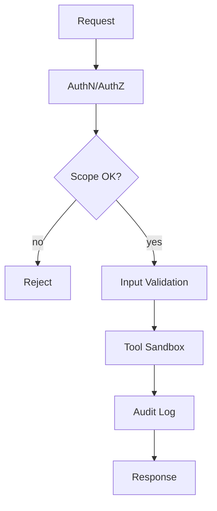

### 07 安全性与合规（参考答案）

- 关键参考: `SECURE_CONFIG_README.md`, `config/settings.py`, `utils/auth/**`, `utils/error_handler.py`

### 一、鉴权与边界
- 接口分级：公开/受限/内部；为受限接口强制鉴权与配额；
- 会话隔离：基于用户/会话/租户注入上下文 ID，后续访问数据库/缓存/向量库均校验命名空间；
- 最小权限：工具仅暴露必要能力，文件/网络访问限定到白名单。

### 二、Prompt 注入与工具滥用
- 语境隔离：将外部检索内容作为“引证材料”并标记来源，避免其直接影响系统指令；
- 白名单上下文：限制可注入的上下文类型与大小；
- 工具前置校验：对 URL/命令/路径做白名单与格式校验；禁止任意命令执行。

### 三、敏感信息与日志脱敏
- 配置注入：API Key/密钥通过 `.env` 或加密文件加载，运行时注入；
- 日志策略：默认脱敏（只显示后四位），对错误堆栈做敏感字段过滤；
- 访问审计：记录“谁、何时、做了什么、影响了哪些资源”。

### 四、工具沙箱与网络边界
- SSRF 防护：拒绝私网地址/内网域名；
- 超时与重定向：限制最大跳转与超时；
- 下载限额：限定单次下载大小与速率；
- 静态执行环境：可选容器化沙箱执行高风险工具。

### 五、审计与合规回溯
- 统一审计流水：Agent 决策、工具调用入参/出参摘要、错误堆栈、trace_id；
- 保留策略：按法规与内部要求设定保留周期与访问控制；
- 导出能力：结构化导出便于审计与复盘。

### 六、作业（实践）
- 设计抓取工具安全策略：
  - 白名单域名+路径前缀；
  - 参数规范化与编码；
  - 超时/大小限制；
  - 频率/并发上限与按租户配额；
  - 违规命中时进入隔离/黑名单并告警。

### 附录：安全网关示意

- 补充图稿：`interview/diagrams/security_gateway.md`。



### 样例回答/评分标准
- 样例回答要点：
  - 鉴权分级与最小权限；跨会话/多租户隔离；
  - Prompt 注入/工具滥用防护（白名单/沙箱/参数校验/网络边界）；
  - 密钥与日志脱敏、审计流水与导出、保留策略；
  - 风控与配额、违规隔离与告警联动。
- 评分标准：
  - 优秀：提供明确的白名单规则、日志字段脱敏清单与审计事件模型；
  - 合格：覆盖主要安全面并给出实践路径；
  - 待提高：概念化、缺少可执行方案。

### 最小可运行示例
```bash
# 访问受限接口时应返回 400/401/403（示例仅演示参数校验失败）
curl -i http://localhost:8000/graph/status \
  -H 'Content-Type: application/json' \
  -d '{"user_id":"","session_id":""}'
```

### 参考答案（示例）
- 鉴权：基于用户/会话/租户的上下文注入，按接口级/操作级最小权限设计；
- 注入防护：外部文本仅作为“引证材料”并标注来源；工具参数白名单校验；网络访问域名白名单与私网拒绝；
- 敏感信息：密钥通过 env/加密文件注入，日志默认脱敏，错误堆栈二次过滤；
- 审计：记录决策/工具入参出参/异常/trace_id，可导出；保留策略按法务确定；
- 风控：配额/限流/隔离；违规命中进入黑名单并触发告警。

### 常见错误与改进建议
- 错误：将用户输入直接拼接进命令/URL。
  - 改进：严格参数校验与编码，命令执行禁用或白名单。
- 错误：日志输出全量密钥/PII。
  - 改进：统一脱敏中间件，字段级掩码与合规审计。
- 错误：跨会话数据越权。
  - 改进：以 user_id/session_id/tenant_id 作为命名空间与访问控制根。