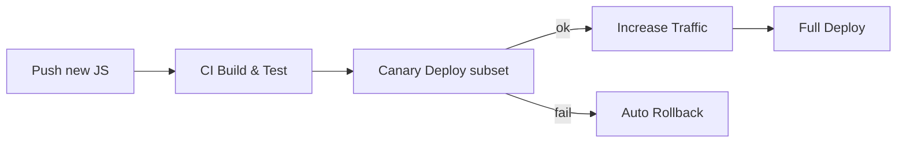

### 08 细节与创新点（参考答案）

- 关键参考: `agents/graph/tool/xhs_search/**`, `agents/graph/redis_checkpoint.py`, `agents/graph/workflows/**`

### 一、创新点盘点
- 反爬签名工程化：
  - JS 版本管理：`static/*.js` 外置 + `execjs` 动态编译，支持多版本并行与快速切换；
  - 组合签名：X-s/X-t/x-s-common/x-b3-traceid/x-xray-traceid 全量覆盖；
  - 并发整形：Cookie 粒度 + 全局粒度双层限流，降低被风控概率。
- 可恢复编排：HITL 的 `interrupt/resume` 与 Redis 检查点，支持跨实例与长会话恢复。
- 依赖收敛：框架依赖仅在 agents+tools，业务/基础设施轻耦合，便于大规模重构与替换。

### 二、工程化建议
- 签名脚本热更新：
  - 版本标识与回滚：为每次上线分配版本号，失败自动回退上一个版本；
  - 健康监控：签名失败率与 4xx/5xx 提升触发告警；
  - 金丝雀：按租户/账号灰度新版本，逐步放量。
- 检查点 SPI：
  - 定义标准接口（读/写/列举/清理）；
  - 适配 Redis/DB/对象存储；
  - 引入版本号/乐观锁，保障并发下的一致性。

### 三、MCP 工具接入思路
- 路线 A（LangChain）：`langchain_mcp_adapters` 将 MCP 工具转为 LangChain 工具，再注入 `create_react_agent`；
- 路线 B（Google GenAI）：利用 `google-genai` 的 MCP 实验特性，直接把 `mcp.ClientSession` 作为工具传入模型配置；
- 两条路线均不影响 apis/utils 层，保持依赖收敛。

### 四、作业（实践）
- 设计“工具市场”：
  - 生命周期：加载/启停/升级/回滚；
  - 权限与配额：按租户/用户/环境；
  - 观测：版本维度的成功率/耗时/错误类型分布；
  - 合规：审计可回溯、导出归档。

### 附录：签名脚本热更新流程

### 样例回答/评分标准
- 样例回答要点：
  - 反爬签名工程化（版本管理、健康监控、金丝雀与回滚）；
  - 可恢复编排与 Redis 检查点选择，以及人审 HITL 的实践；
  - 依赖收敛的收益与替换策略。
- 评分标准：
  - 优秀：提出完整的上线/回滚/监控闭环与度量；
  - 合格：能说明主要创新点与工程价值；
  - 待提高：仅罗列点不成体系。

### 参考答案（示例）
- 反爬签名工程化：
  - static/*.js 外置与版本化；`execjs` 动态编译；失败率/4xx/5xx 监控；金丝雀灰度与自动回滚；
  - 组合签名（X-s/X-t/x-s-common/x-b3-traceid/x-xray-traceid）与代理透传；
- 可恢复编排：
  - `interrupt/resume` + Redis 检查点实现人审在环与跨实例恢复；
  - 恢复后仅重放无副作用节点；外部副作用节点幂等/补偿；
- 依赖收敛：
  - LangChain/LangGraph 仅在编排与工具层使用，业务与基础设施层保持独立，降低替换成本与测试复杂度。

### 常见错误与改进建议
- 错误：签名脚本热更新无版本与回滚。
  - 改进：版本号/金丝雀/自动回滚三件套，失败率阈值触发。
- 错误：人审流程与恢复点散落不同文件。
  - 改进：统一在节点内 `interrupt` 与在 api 层集中 `resume`，文档化恢复协议。

- 补充图稿：`interview/diagrams/xhs_hot_update.md`。