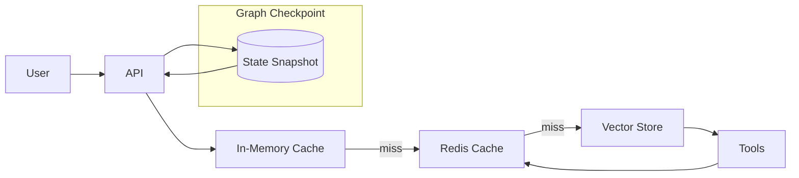

### 09 缓存与 KV-Cache（参考答案）

- 关键参考: `check_context_cache_*.py`, `utils/**`, `agents/graph/redis_checkpoint.py`

### 一、类型与收益
- 应用层缓存：以请求语义为键缓存结果（检索结果/工具响应/LLM 输出），命中收益直接等于避开的下游代价（时延/成本）。
- 模型 KV-Cache：复用前序注意力 Key/Value，降低长上下文推理成本；项目无法直接控制，但可通过“分段提示/模板复用”间接受益。

### 二、键设计与并发防护
- 规范：`hash(prompt|tools|model|params|user|version)`；
- 版本：当 Prompt/工具/模型变更时提升 `version` 防止污染；
- 防抖：对同键的并发请求做“请求合并”，避免穿透下游；
- TTL：根据稳定性/成本设差异化 TTL（如检索 30-120s，重代价工具 5-30min）。

### 三、多级缓存
- L1 内存：极低延迟，容量小；
- L2 Redis：跨实例共享；
- L3 向量库：语义近邻命中，命中后仍需合并/压缩再注入；
- 失效：主动（版本升级/命中异常）+ 被动（TTL/LRU）。

### 四、与检查点的关系
- 检查点是“过程状态缓存”，与“结果缓存”相辅相成；
- 恢复后可直接命中结果缓存减少重放成本；
- 注意一致性：检查点恢复后，若外部世界已变，需要对缓存做再验证。

### 五、实操建议
- 为 `vector_search` 加缓存：key=embedding hash + filters；
- XHS 搜索缓存：key=keyword+sort+page+type+geo（+cookie hash），TTL 短；
- 指标：命中率、平均时延、P95、下游调用下降比例；异常回滚策略（命中异常率阈值触发）。

### 附录：多级缓存与检查点关系图

### 样例回答/评分标准
- 样例回答要点：
  - 应用缓存 vs KV-Cache 的区别、键规范、版本与 TTL 策略；
  - 多级缓存（L1/L2/向量库）与检查点的互补；
  - 命中异常的回滚策略与观测指标（命中率/陈旧率/时延）。
- 评分标准：
  - 优秀：提供键规范与失效策略矩阵；
  - 合格：能说明层级与策略；
  - 待提高：不区分缓存类型或缺少回滚方案。

### 参考答案（示例）
- 键规范：
  - 应用缓存：`hash(prompt|tools|model|params|user|version)`；
  - 检索缓存：`embedding_hash|filters|topk|version`；
  - 版本字段用于 Prompt/工具/模型升级防污染；
- 多级缓存：
  - L1 内存（极低延迟）；L2 Redis（跨实例共享）；L3 向量库（语义召回）；
  - 命中异常回滚：命中异常率/陈旧率阈值触发禁用与回滚。
- 与检查点：
  - 检查点记录过程状态，减少恢复成本；
  - 结果缓存与检查点互补，恢复后可直接命中结果缓存避免重复计算。

### 常见错误与改进建议
- 错误：缓存击穿/雪崩导致下游被打爆。
  - 改进：热点预热、随机 TTL、请求合并、防穿透（空值缓存）。
- 错误：键过粗，误命中跨用户/版本数据。
  - 改进：将 user/tenant/version 纳入键空间，分层缓存隔离。

- 补充图稿：`interview/diagrams/cache_checkpoint.md`。