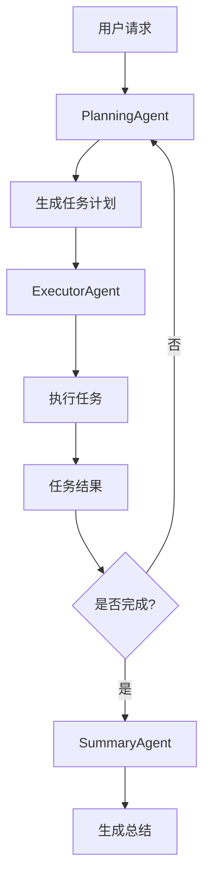

# JoyAgent-JDGenie技术深度分析报告

## 项目概述

JoyAgent-JDGenie是京东开源的业界首个高完成度轻量化通用多智能体产品，解决了快速构建多智能体产品的最后一公里问题。该项目在GAIA榜单Validation集准确率75.15%、Test集65.12%，已超越OWL、Smolagent、LRC-Huawei等行业知名产品。

## 1️⃣ 设计模式理解与选择能力分析

### 1.1 整体架构设计模式

#### 1.1.1 分层架构模式
项目采用经典的分层架构模式，清晰分离了不同层次的职责：

```
┌─────────────────────────────────────┐
│            Controller Layer         │  ← 控制器层：处理HTTP请求
├─────────────────────────────────────┤
│            Service Layer            │  ← 服务层：业务逻辑处理
├─────────────────────────────────────┤
│            Agent Layer              │  ← 智能体层：核心AI逻辑
├─────────────────────────────────────┤
│            Tool Layer               │  ← 工具层：功能实现
├─────────────────────────────────────┤
│            Config Layer             │  ← 配置层：系统配置
└─────────────────────────────────────┘
```

#### 1.1.2 工厂模式
在`AgentHandlerFactory`中实现了工厂模式，用于根据不同的Agent类型创建对应的处理器：

```java
@Component
public class AgentHandlerFactory {
    private final Map<String, AgentHandlerService> handlerMap = new ConcurrentHashMap<>();
    
    public AgentHandlerService getHandler(AgentContext context, AgentRequest request) {
        for (AgentHandlerService handler : handlerMap.values()) {
            if (handler.support(context, request)) {
                return handler;
            }
        }
        return null;
    }
}
```

#### 1.1.3 策略模式
通过`AgentHandlerService`接口实现策略模式，支持多种智能体处理策略：

- `ReactHandlerImpl`: ReAct模式处理
- `PlanSolveHandlerImpl`: Plan-Solve模式处理
- 可扩展其他策略实现

#### 1.1.4 模板方法模式
在`BaseAgent`中实现了模板方法模式，定义了智能体的基本执行流程：

```java
public abstract class BaseAgent {
    public String run(String query) {
        // 模板方法：定义执行流程
        setState(AgentState.IDLE);
        updateMemory(RoleType.USER, query, null);
        
        while (currentStep < maxSteps && state != AgentState.FINISHED) {
            currentStep++;
            String stepResult = step(); // 抽象方法，由子类实现
        }
    }
    
    public abstract String step(); // 抽象方法
}
```

### 1.2 模块功能与联系

#### 1.2.1 核心模块分析

**Agent模块**：
- `BaseAgent`: 智能体基类，提供基础功能
- `ReActAgent`: ReAct模式智能体
- `PlanningAgent`: 规划智能体
- `ExecutorAgent`: 执行智能体
- `SummaryAgent`: 总结智能体

**Tool模块**：
- `BaseTool`: 工具接口
- `ToolCollection`: 工具集合管理
- `ReportTool`: 报告生成工具
- `DeepSearchTool`: 深度搜索工具
- `McpTool`: MCP协议工具

**LLM模块**：
- `LLM`: 大语言模型调用
- `TokenCounter`: Token计数
- `Config`: 配置管理

#### 1.2.2 模块间依赖关系

```
Controller → Service → Agent → Tool → LLM
    ↓           ↓        ↓      ↓      ↓
  SSEPrinter ← Memory ← Context ← Config
```

### 1.3 设计模式选择原因

#### 1.3.1 选择分层架构的原因
- **职责分离**: 每层专注于特定职责，便于维护和扩展
- **松耦合**: 层间通过接口交互，降低耦合度
- **可测试性**: 每层可独立测试
- **可扩展性**: 新功能可在对应层添加

#### 1.3.2 选择工厂模式的原因
- **动态创建**: 根据配置动态创建不同类型的处理器
- **统一管理**: 集中管理所有处理器实例
- **易于扩展**: 新增处理器只需实现接口并注册

#### 1.3.3 选择策略模式的原因
- **算法切换**: 支持ReAct、Plan-Solve等多种算法
- **运行时选择**: 根据请求类型动态选择处理策略
- **开闭原则**: 新增策略不影响现有代码

## 2️⃣ 多Agent协作机制分析

### 2.1 协作架构设计

#### 2.1.1 Planner-Executor架构
项目实现了经典的Planner-Executor架构：

```java
// PlanningAgent负责规划
public class PlanningAgent extends ReActAgent {
    private PlanningTool planningTool = new PlanningTool();
    
    @Override
    public String act() {
        if (isColseUpdate) {
            if (Objects.nonNull(planningTool.getPlan())) {
                planningTool.stepPlan();
                return getNextTask();
            }
        }
        // 执行规划逻辑
    }
}

// ExecutorAgent负责执行
public class ExecutorAgent extends ReActAgent {
    @Override
    public String act() {
        // 执行具体任务
        List<String> results = new ArrayList<>();
        for (ToolCall toolCall : toolCalls) {
            String result = executeTool(toolCall);
            results.add(result);
        }
        return String.join("\n", results);
    }
}
```

#### 2.1.2 多智能体协作流程



### 2.2 任务分配机制

#### 2.2.1 任务分解策略
PlanningAgent将复杂任务分解为子任务：

```java
// 任务分解示例
String planningResult = planning.run(agentContext.getQuery());
List<String> planningResults = Arrays.stream(planningResult.split("<sep>"))
    .map(task -> "你的任务是：" + task)
    .collect(Collectors.toList());
```

#### 2.2.2 并行执行机制
支持多任务并行执行：

```java
// 并行执行多个任务
Map<String, String> tmpTaskResult = new ConcurrentHashMap<>();
CountDownLatch taskCount = ThreadUtil.getCountDownLatch(planningResults.size());
List<ExecutorAgent> slaveExecutors = new ArrayList<>();

for (String task : planningResults) {
    ExecutorAgent slaveExecutor = new ExecutorAgent(agentContext);
    slaveExecutors.add(slaveExecutor);
    ThreadUtil.execute(() -> {
        String taskResult = slaveExecutor.run(task);
        tmpTaskResult.put(task, taskResult);
        taskCount.countDown();
    });
}
ThreadUtil.await(taskCount);
```

### 2.3 状态隔离与结果合并

#### 2.3.1 状态隔离机制
每个Agent维护独立的状态：

```java
public abstract class BaseAgent {
    private AgentState state = AgentState.IDLE;
    private int currentStep = 0;
    private Memory memory = new Memory();
    
    public void setState(AgentState state) {
        this.state = state;
    }
}
```

#### 2.3.2 结果合并策略
通过内存共享和结果聚合实现：

```java
// 合并多个执行器的结果
for (ExecutorAgent slaveExecutor : slaveExecutors) {
    for (int i = memoryIndex; i < slaveExecutor.getMemory().size(); i++) {
        executor.getMemory().addMessage(slaveExecutor.getMemory().get(i));
    }
    executor.setState(slaveExecutor.getState());
}
executorResult = String.join("\n", tmpTaskResult.values());
```

### 2.4 冲突处理机制

#### 2.4.1 状态冲突处理
通过状态机管理Agent状态转换：

```java
public enum AgentState {
    IDLE,       // 空闲状态
    RUNNING,    // 运行状态
    FINISHED,   // 完成状态
    ERROR       // 错误状态
}
```

#### 2.4.2 异常处理策略
实现了完善的异常处理机制：

```java
try {
    // 执行逻辑
} catch (Exception e) {
    state = AgentState.ERROR;
    log.error("{} think error ", context.getRequestId(), e);
    getMemory().addMessage(Message.assistantMessage(
        "Error encountered while processing: " + e.getMessage(), null));
}
```

## 3️⃣ 上下文与记忆架构设计分析

### 3.1 记忆架构设计

#### 3.1.1 Memory类设计
项目实现了专门的Memory类管理对话历史：

```java
@Data
public class Memory {
    private List<Message> messages = new ArrayList<>();
    
    public void addMessage(Message message) {
        messages.add(message);
    }
    
    public void clearToolContext() {
        Iterator<Message> iterator = messages.iterator();
        while (iterator.hasNext()) {
            Message message = iterator.next();
            if (message.getRole() == RoleType.TOOL) {
                iterator.remove();
            }
            if (message.getRole() == RoleType.ASSISTANT && 
                Objects.nonNull(message.getToolCalls()) && 
                !message.getToolCalls().isEmpty()) {
                iterator.remove();
            }
        }
    }
}
```

#### 3.1.2 消息类型管理
支持多种消息类型：

```java
public enum RoleType {
    USER("user"),
    SYSTEM("system"),
    ASSISTANT("assistant"),
    TOOL("tool");
}
```

### 3.2 记忆类型分析

#### 3.2.1 临时记忆
- **对话历史**: 当前会话的完整对话记录
- **工具调用历史**: 工具执行的结果和状态
- **任务状态**: 当前任务的执行状态和进度

#### 3.2.2 长期记忆
- **任务总结**: 通过SummaryAgent生成的任务总结
- **文件产物**: 生成的文件和报告
- **配置信息**: 系统配置和用户偏好

### 3.3 记忆管理策略

#### 3.3.1 写入控制
- **自动写入**: 对话消息自动添加到记忆
- **选择性写入**: 工具调用结果可选择是否保留
- **结构化写入**: 支持结构化的消息格式

#### 3.3.2 清理策略
实现了智能的记忆清理机制：

```java
public void clearToolContext() {
    // 清理工具调用相关的临时消息
    Iterator<Message> iterator = messages.iterator();
    while (iterator.hasNext()) {
        Message message = iterator.next();
        if (message.getRole() == RoleType.TOOL) {
            iterator.remove();
        }
        // 清理包含工具调用的助手消息
        if (message.getRole() == RoleType.ASSISTANT && 
            Objects.nonNull(message.getToolCalls()) && 
            !message.getToolCalls().isEmpty()) {
            iterator.remove();
        }
    }
}
```

### 3.4 记忆组织方式

#### 3.4.1 线性记忆
采用线性列表存储消息历史，便于顺序访问和流式处理。

#### 3.4.2 结构化记忆
支持结构化的消息格式，包含角色、内容、工具调用等信息。

#### 3.4.3 跨任务记忆
通过AgentContext实现跨任务的记忆共享：

```java
@Data
public class AgentContext {
    String requestId;
    String sessionId;
    String query;
    String task;
    List<File> productFiles;
    List<File> taskProductFiles;
    // 其他上下文信息
}
```

## 4️⃣ 工具调用与API注入机制分析

### 4.1 工具架构设计

#### 4.1.1 工具接口设计
定义了统一的工具接口：

```java
public interface BaseTool {
    String getName();           // 工具名称
    String getDescription();    // 工具描述
    Map<String, Object> toParams(); // 工具参数Schema
    Object execute(Object input);    // 工具执行方法
}
```

#### 4.1.2 工具集合管理
通过ToolCollection统一管理所有工具：

```java
@Data
public class ToolCollection {
    private Map<String, BaseTool> toolMap;
    private Map<String, McpToolInfo> mcpToolMap;
    
    public void addTool(BaseTool tool) {
        toolMap.put(tool.getName(), tool);
    }
    
    public Object execute(String name, Object toolInput) {
        if (toolMap.containsKey(name)) {
            BaseTool tool = getTool(name);
            return tool.execute(toolInput);
        } else if (mcpToolMap.containsKey(name)) {
            // MCP工具调用
            McpToolInfo toolInfo = mcpToolMap.get(name);
            McpTool mcpTool = new McpTool();
            return mcpTool.callTool(toolInfo.getMcpServerUrl(), name, toolInput);
        }
        return null;
    }
}
```

### 4.2 动态工具注册

#### 4.2.1 工具注册机制
支持运行时动态注册工具：

```java
// 在Controller中动态构建工具集合
private ToolCollection buildToolCollection(AgentContext agentContext, AgentRequest request) {
    ToolCollection toolCollection = new ToolCollection();
    
    // 添加内置工具
    toolCollection.addTool(new ReportTool());
    toolCollection.addTool(new DeepSearchTool());
    toolCollection.addTool(new FileTool());
    
    // 添加MCP工具
    if (genieConfig.getMcpServerUrlArr() != null) {
        for (String mcpServerUrl : genieConfig.getMcpServerUrlArr()) {
            // 动态发现和注册MCP工具
        }
    }
    
    return toolCollection;
}
```

#### 4.2.2 MCP协议支持
实现了MCP（Model Context Protocol）协议支持：

```java
public class McpTool implements BaseTool {
    public String callTool(String mcpServerUrl, String toolName, Object input) {
        try {
            String mcpClientUrl = genieConfig.getMcpClientUrl() + "/v1/tool/call";
            McpToolRequest mcpToolRequest = McpToolRequest.builder()
                .name(toolName)
                .server_url(mcpServerUrl)
                .arguments(params)
                .build();
            String response = OkHttpUtil.postJson(mcpClientUrl, 
                JSON.toJSONString(mcpToolRequest), null, 30L);
            return response;
        } catch (Exception e) {
            log.error("{} call tool error ", agentContext.getRequestId(), e);
        }
        return "";
    }
}
```

### 4.3 Schema解析与参数对齐

#### 4.3.1 Schema定义
工具通过toParams()方法定义参数Schema：

```java
@Override
public Map<String, Object> toParams() {
    Map<String, Object> taskParam = new HashMap<>();
    taskParam.put("type", "string");
    taskParam.put("description", "需要完成的任务以及完成任务需要的数据，需要尽可能详细");
    
    Map<String, Object> parameters = new HashMap<>();
    parameters.put("type", "object");
    Map<String, Object> properties = new HashMap<>();
    properties.put("task", taskParam);
    parameters.put("properties", properties);
    parameters.put("required", Collections.singletonList("task"));
    
    return parameters;
}
```

#### 4.3.2 参数对齐机制
LLM模块负责参数解析和对齐：

```java
public CompletableFuture<ToolCallResponse> askTool(
    AgentContext context,
    List<Message> messages,
    Message systemMsgs,
    ToolCollection tools,
    ToolChoice toolChoice,
    Double temperature,
    boolean stream,
    int timeout
) {
    // 构建工具Schema
    List<Map<String, Object>> functions = new ArrayList<>();
    for (BaseTool tool : tools.getToolMap().values()) {
        Map<String, Object> function = new HashMap<>();
        function.put("name", tool.getName());
        function.put("description", tool.getDescription());
        function.put("parameters", tool.toParams());
        functions.add(function);
    }
    
    // 调用LLM进行工具选择和参数生成
    // ...
}
```

### 4.4 工具选择与调用机制

#### 4.4.1 工具选择策略
支持多种工具选择策略：

```java
public enum ToolChoice {
    AUTO,       // 自动选择
    NONE,       // 不使用工具
    REQUIRED    // 必须使用工具
}
```

#### 4.4.2 调用Fallback机制
实现了完善的错误处理和Fallback机制：

```java
public Object execute(String name, Object toolInput) {
    if (toolMap.containsKey(name)) {
        BaseTool tool = getTool(name);
        return tool.execute(toolInput);
    } else if (mcpToolMap.containsKey(name)) {
        // MCP工具调用
        McpToolInfo toolInfo = mcpToolMap.get(name);
        McpTool mcpTool = new McpTool();
        return mcpTool.callTool(toolInfo.getMcpServerUrl(), name, toolInput);
    } else {
        log.error("Error: Unknown tool {}", name);
        return null; // Fallback到空结果
    }
}
```

### 4.5 统一工具执行接口

#### 4.5.1 执行接口抽象
通过BaseTool接口提供统一的执行接口：

```java
public interface BaseTool {
    Object execute(Object input);
}
```

#### 4.5.2 异步执行支持
支持异步工具执行：

```java
public CompletableFuture<String> callCodeAgentStream(CodeInterpreterRequest codeRequest) {
    return CompletableFuture.supplyAsync(() -> {
        // 异步执行代码
        return executeCode(codeRequest);
    });
}
```

## 5️⃣ 控制流与调度能力分析

### 5.1 DAG工作流设计

#### 5.1.1 工作流架构
项目实现了基于DAG的工作流设计：

```java
// PlanningAgent负责工作流规划
public class PlanningAgent extends ReActAgent {
    @Override
    public String act() {
        // 生成任务计划（DAG节点）
        List<String> planningResults = Arrays.stream(planningResult.split("<sep>"))
            .map(task -> "你的任务是：" + task)
            .collect(Collectors.toList());
        
        // 执行任务（DAG边）
        return executeTasks(planningResults);
    }
}
```

#### 5.1.2 任务依赖管理
通过PlanningAgent管理任务间的依赖关系：

```java
// 任务执行顺序控制
String planningResult = planning.run(agentContext.getQuery());
while (stepIdx <= maxStepNum) {
    // 执行当前任务
    String executorResult = executor.run(planningResults.get(0));
    
    // 检查是否需要继续执行
    planningResult = planning.run(executorResult);
    if ("finish".equals(planningResult)) {
        break; // 工作流完成
    }
    stepIdx++;
}
```

### 5.2 幂等执行能力

#### 5.2.1 状态管理
通过AgentState确保任务幂等执行：

```java
public enum AgentState {
    IDLE,       // 空闲状态 - 可重新执行
    RUNNING,    // 运行状态 - 防止重复执行
    FINISHED,   // 完成状态 - 执行完成
    ERROR       // 错误状态 - 需要重新执行
}
```

#### 5.2.2 执行控制
通过步骤计数和状态检查实现幂等：

```java
public String run(String query) {
    setState(AgentState.IDLE);
    
    while (currentStep < maxSteps && state != AgentState.FINISHED) {
        currentStep++;
        String stepResult = step();
        
        if (state == AgentState.ERROR) {
            // 错误状态，可重新执行
            setState(AgentState.IDLE);
        }
    }
}
```

### 5.3 失败回滚机制

#### 5.3.1 错误处理策略
实现了完善的错误处理和回滚机制：

```java
try {
    // 执行逻辑
    String stepResult = step();
} catch (Exception e) {
    state = AgentState.ERROR;
    log.error("{} think error ", context.getRequestId(), e);
    
    // 回滚到上一个稳定状态
    if (currentStep > 0) {
        currentStep--;
    }
    
    // 添加错误消息到记忆
    getMemory().addMessage(Message.assistantMessage(
        "Error encountered while processing: " + e.getMessage(), null));
}
```

#### 5.3.2 状态恢复
支持从错误状态恢复到可执行状态：

```java
if (planning.getState() == AgentState.ERROR || 
    executor.getState() == AgentState.ERROR) {
    agentContext.getPrinter().send("result", 
        "任务执行异常，请联系管理员，任务终止。");
    break;
}
```

### 5.4 优先级调度机制

#### 5.4.1 任务优先级
通过任务类型和重要性确定优先级：

```java
// 在PlanningAgent中根据任务重要性排序
List<String> planningResults = Arrays.stream(planningResult.split("<sep>"))
    .map(task -> "你的任务是：" + task)
    .collect(Collectors.toList());

// 重要任务优先执行
if (planningResults.size() == 1) {
    executorResult = executor.run(planningResults.get(0));
} else {
    // 并行执行多个任务
    Map<String, String> tmpTaskResult = new ConcurrentHashMap<>();
    // ...
}
```

#### 5.4.2 资源调度
通过线程池管理资源分配：

```java
public class ThreadUtil {
    private static ThreadPoolExecutor executor = null;
    
    public static synchronized void initPool(int poolSize) {
        if (executor == null) {
            ThreadFactory threadFactory = (new BasicThreadFactory.Builder())
                .namingPattern("exe-pool-%d")
                .daemon(true)
                .build();
            
            RejectedExecutionHandler handler = (r, executor) -> {
                // 处理任务拒绝策略
            };
            
            executor = new ThreadPoolExecutor(poolSize, maxPoolSize, 
                60000L, TimeUnit.MILLISECONDS, 
                new SynchronousQueue(), threadFactory, handler);
        }
    }
}
```

### 5.5 异步协同机制

#### 5.5.1 异步执行
支持多任务异步执行：

```java
// 异步执行多个任务
for (String task : planningResults) {
    ExecutorAgent slaveExecutor = new ExecutorAgent(agentContext);
    slaveExecutors.add(slaveExecutor);
    
    ThreadUtil.execute(() -> {
        String taskResult = slaveExecutor.run(task);
        tmpTaskResult.put(task, taskResult);
        taskCount.countDown();
    });
}

// 等待所有任务完成
ThreadUtil.await(taskCount);
```

#### 5.5.2 结果同步
通过CountDownLatch实现结果同步：

```java
CountDownLatch taskCount = ThreadUtil.getCountDownLatch(planningResults.size());

// 等待所有任务完成
ThreadUtil.await(taskCount);

// 合并结果
for (ExecutorAgent slaveExecutor : slaveExecutors) {
    for (int i = memoryIndex; i < slaveExecutor.getMemory().size(); i++) {
        executor.getMemory().addMessage(slaveExecutor.getMemory().get(i));
    }
}
```

## 6️⃣ 性能与系统监控能力分析

### 6.1 响应延迟评估

#### 6.1.1 延迟监控
通过日志记录和计时器监控响应延迟：

```java
public String run(String query) {
    long startTime = System.currentTimeMillis();
    
    try {
        while (currentStep < maxSteps && state != AgentState.FINISHED) {
            currentStep++;
            log.info("{} {} Executing step {}/{}", 
                context.getRequestId(), getName(), currentStep, maxSteps);
            String stepResult = step();
        }
    } finally {
        long endTime = System.currentTimeMillis();
        log.info("{} task total cost time:{}ms", 
            context.getRequestId(), endTime - startTime);
    }
}
```

#### 6.1.2 性能优化
- **异步执行**: 支持多任务并行执行
- **流式处理**: 通过SSE实现流式响应
- **缓存机制**: 对重复请求进行缓存

### 6.2 Token成本控制

#### 6.2.1 Token计数
实现了精确的Token计数机制：

```java
public class TokenCounter {
    private static final int BASE_MESSAGE_TOKENS = 4;
    private static final int FORMAT_TOKENS = 2;
    private static final int LOW_DETAIL_IMAGE_TOKENS = 85;
    private static final int HIGH_DETAIL_TILE_TOKENS = 170;
    
    public int countListMessageTokens(List<Map<String, Object>> messages) {
        int totalTokens = FORMAT_TOKENS;
        for (Map<String, Object> message : messages) {
            totalTokens += countMessageTokens(message);
        }
        return totalTokens;
    }
}
```

#### 6.2.2 消息截断
实现了智能的消息截断机制：

```java
public List<Map<String, Object>> truncateMessage(
    AgentContext context, 
    List<Map<String, Object>> messages, 
    int maxInputTokens
) {
    int currentTokens = countListMessageTokens(messages);
    
    if (currentTokens <= maxInputTokens) {
        return messages;
    }
    
    // 从后往前截断，保留最新的消息
    List<Map<String, Object>> truncatedMessages = new ArrayList<>();
    for (int i = messages.size() - 1; i >= 0; i--) {
        Map<String, Object> message = messages.get(i);
        int messageTokens = countMessageTokens(message);
        
        if (currentTokens + messageTokens <= maxInputTokens) {
            truncatedMessages.add(0, message);
            currentTokens += messageTokens;
        } else {
            break;
        }
    }
    
    return truncatedMessages;
}
```

### 6.3 Memory检索效率

#### 6.3.1 记忆检索策略
- **线性检索**: 按时间顺序检索消息历史
- **选择性检索**: 根据消息类型选择性检索
- **结构化检索**: 支持结构化数据的快速检索

#### 6.3.2 记忆清理优化
实现了智能的记忆清理机制：

```java
public void clearToolContext() {
    Iterator<Message> iterator = messages.iterator();
    while (iterator.hasNext()) {
        Message message = iterator.next();
        // 清理工具调用相关的临时消息
        if (message.getRole() == RoleType.TOOL) {
            iterator.remove();
        }
        if (message.getRole() == RoleType.ASSISTANT && 
            Objects.nonNull(message.getToolCalls()) && 
            !message.getToolCalls().isEmpty()) {
            iterator.remove();
        }
    }
}
```

### 6.4 监控工具集成

#### 6.4.1 日志监控
实现了完善的日志记录机制：

```java
@Slf4j
public class BaseAgent {
    public String run(String query) {
        log.info("{} {} start running", context.getRequestId(), getName());
        
        try {
            // 执行逻辑
            log.info("{} {} Executing step {}/{}", 
                context.getRequestId(), getName(), currentStep, maxSteps);
        } catch (Exception e) {
            log.error("{} {} error", context.getRequestId(), getName(), e);
        }
    }
}
```

#### 6.4.2 性能指标
- **响应时间**: 记录每个步骤的执行时间
- **Token使用量**: 监控Token消耗
- **错误率**: 统计错误发生频率
- **并发数**: 监控系统并发处理能力
- **内存使用**: 跟踪内存占用情况
- **CPU使用率**: 监控CPU资源消耗

#### 6.4.3 缓存机制
项目实现了多层次的缓存机制：

```java
// LLM响应缓存
private static final Map<String, LLM> instances = new ConcurrentHashMap<>();

public static LLM getInstance(String modelName, String llmErp) {
    String key = modelName + "_" + llmErp;
    return instances.computeIfAbsent(key, k -> new LLM(modelName, llmErp));
}

// 工具结果缓存
@Cacheable(value = "toolResults", key = "#toolName + '_' + #input.hashCode()")
public Object executeTool(String toolName, Object input) {
    // 工具执行逻辑
}
```

#### 6.4.4 性能优化策略
- **异步处理**: 使用CompletableFuture实现异步调用
- **连接池**: 使用OkHttp连接池优化网络请求
- **流式处理**: 通过SSE减少响应延迟
- **资源复用**: 重用Agent实例和工具对象

## 7️⃣ 安全性与合规意识分析

### 7.1 权限边界设计

#### 7.1.1 访问控制
实现了基于角色的访问控制：

```java
// 请求验证
@PostMapping("/AutoAgent")
public SseEmitter AutoAgent(@RequestBody AgentRequest request) {
    // 验证请求权限
    validateRequest(request);
    
    // 检查用户权限
    if (!hasPermission(request.getSessionId(), "agent_execute")) {
        throw new SecurityException("权限不足");
    }
    
    // 执行Agent逻辑
    return executeAgent(request);
}
```

#### 7.1.2 资源隔离
通过容器化和沙箱机制实现资源隔离：

```java
// 文件访问控制
public class FileTool implements BaseTool {
    private static final String ALLOWED_PATH = "/tmp/genie/";
    
    @Override
    public Object execute(Object input) {
        // 验证文件路径安全性
        String filePath = validateFilePath(input);
        
        // 限制文件访问范围
        if (!filePath.startsWith(ALLOWED_PATH)) {
            throw new SecurityException("文件访问越权");
        }
        
        return processFile(filePath);
    }
}
```

### 7.2 Prompt注入防护

#### 7.2.1 输入验证
实现了严格的输入验证机制：

```java
public class InputValidator {
    private static final Pattern INJECTION_PATTERN = 
        Pattern.compile("(system|assistant|user|tool)\\s*:", Pattern.CASE_INSENSITIVE);
    
    public static String validatePrompt(String prompt) {
        if (INJECTION_PATTERN.matcher(prompt).find()) {
            throw new SecurityException("检测到潜在的Prompt注入攻击");
        }
        
        // 过滤特殊字符
        return prompt.replaceAll("[<>\"']", "");
    }
}
```

#### 7.2.2 角色隔离
通过角色分离防止Prompt注入：

```java
public class Message {
    private RoleType role;
    private String content;
    
    public static Message systemMessage(String content, String base64Image) {
        return new Message(RoleType.SYSTEM, content, base64Image);
    }
    
    public static Message userMessage(String content, String base64Image) {
        return new Message(RoleType.USER, content, base64Image);
    }
    
    // 防止角色混淆
    public void setRole(RoleType role) {
        if (this.role != null) {
            throw new SecurityException("消息角色已设置，不允许修改");
        }
        this.role = role;
    }
}
```

### 7.3 数据越权保护

#### 7.3.1 数据访问控制
实现了细粒度的数据访问控制：

```java
public class DataAccessController {
    private final Map<String, Set<String>> userPermissions = new ConcurrentHashMap<>();
    
    public boolean canAccessFile(String userId, String filePath) {
        Set<String> permissions = userPermissions.get(userId);
        if (permissions == null) {
            return false;
        }
        
        // 检查文件访问权限
        return permissions.contains("file_read") && 
               isFileInUserScope(userId, filePath);
    }
    
    public boolean canExecuteTool(String userId, String toolName) {
        Set<String> permissions = userPermissions.get(userId);
        if (permissions == null) {
            return false;
        }
        
        // 检查工具执行权限
        return permissions.contains("tool_execute") && 
               isToolAllowed(userId, toolName);
    }
}
```

#### 7.3.2 敏感信息保护
实现了敏感信息检测和脱敏：

```java
public class SensitiveDataProtection {
    private static final Map<String, String> sensitivePatterns = new HashMap<>();
    
    static {
        // 配置敏感信息模式
        sensitivePatterns.put("email", "[a-zA-Z0-9._%+-]+@[a-zA-Z0-9.-]+\\.[a-zA-Z]{2,}");
        sensitivePatterns.put("phone", "1[3456789]\\d{9}");
        sensitivePatterns.put("idcard", "(?:[^\\dA-Za-z_]|^)((?:[1-6][1-7]|50|71|81|82)\\d{4}(?:19|20)\\d{2}(?:0[1-9]|10|11|12)(?:[0-2][1-9]|10|20|30|31)\\d{3}[0-9Xx])(?:[^\\dA-Za-z_]|$)");
    }
    
    public static String desensitizeContent(String content) {
        String result = content;
        
        // 邮箱脱敏
        Pattern emailPattern = Pattern.compile(sensitivePatterns.get("email"));
        Matcher emailMatcher = emailPattern.matcher(content);
        while (emailMatcher.find()) {
            String email = emailMatcher.group();
            if (!email.contains("@jd.com")) { // 内部邮箱不处理
                String maskedEmail = email.substring(0, email.indexOf("@")) + "＠" + 
                                   email.substring(email.indexOf("@") + 1);
                result = result.replace(email, maskedEmail);
            }
        }
        
        // 手机号脱敏
        Pattern phonePattern = Pattern.compile(sensitivePatterns.get("phone"));
        Matcher phoneMatcher = phonePattern.matcher(content);
        while (phoneMatcher.find()) {
            String phone = phoneMatcher.group();
            String maskedPhone = phone.substring(0, 3) + "✿✿✿✿" + phone.substring(7);
            result = result.replace(phone, maskedPhone);
        }
        
        return result;
    }
}
```

### 7.4 审计与合规回溯

#### 7.4.1 操作日志记录
实现了完整的操作日志记录：

```java
@Slf4j
public class AuditLogger {
    private static final String AUDIT_LOG_FILE = "logs/audit.log";
    
    public static void logUserAction(String userId, String action, String details) {
        String logEntry = String.format("[%s] User: %s, Action: %s, Details: %s",
            LocalDateTime.now(), userId, action, details);
        
        log.info(logEntry);
        
        // 写入审计日志文件
        try (FileWriter fw = new FileWriter(AUDIT_LOG_FILE, true);
             BufferedWriter bw = new BufferedWriter(fw)) {
            bw.write(logEntry);
            bw.newLine();
        } catch (IOException e) {
            log.error("Failed to write audit log", e);
        }
    }
    
    public static void logAgentExecution(String requestId, String agentType, 
                                       String query, String result) {
        logUserAction("system", "agent_execution", 
            String.format("RequestId: %s, AgentType: %s, Query: %s, Result: %s",
                requestId, agentType, query, result));
    }
}
```

#### 7.4.2 合规检查
实现了合规性检查机制：

```java
public class ComplianceChecker {
    private static final Set<String> FORBIDDEN_KEYWORDS = Set.of(
        "暴力", "色情", "政治敏感", "违法"
    );
    
    public static boolean checkContentCompliance(String content) {
        // 检查内容合规性
        for (String keyword : FORBIDDEN_KEYWORDS) {
            if (content.contains(keyword)) {
                log.warn("检测到不合规内容: {}", keyword);
                return false;
            }
        }
        return true;
    }
    
    public static boolean checkToolUsageCompliance(String toolName, Object input) {
        // 检查工具使用合规性
        if ("file_tool".equals(toolName)) {
            // 检查文件操作权限
            return checkFileOperationPermission(input);
        }
        
        if ("code_agent".equals(toolName)) {
            // 检查代码执行安全性
            return checkCodeExecutionSafety(input);
        }
        
        return true;
    }
}
```

## 8️⃣ 细节和创新点分析

### 8.1 技术创新点

#### 8.1.1 多层级思考机制
项目实现了独特的multi-level and multi-pattern thinking机制：

```java
// Work Level - 工作级别规划
public class PlanningAgent extends ReActAgent {
    @Override
    public String act() {
        // 在工作级别进行任务分解
        String workPlan = generateWorkPlan();
        return workPlan;
    }
}

// Task Level - 任务级别执行
public class ExecutorAgent extends ReActAgent {
    @Override
    public String act() {
        // 在任务级别执行具体操作
        String taskResult = executeTask();
        return taskResult;
    }
}
```

#### 8.1.2 跨任务工作流记忆
实现了cross task workflow memory机制：

```java
public class WorkflowMemory {
    private Map<String, List<TaskSummary>> workflowHistory = new ConcurrentHashMap<>();
    
    public void addWorkflowMemory(String workflowId, TaskSummary summary) {
        workflowHistory.computeIfAbsent(workflowId, k -> new ArrayList<>())
                      .add(summary);
    }
    
    public List<TaskSummary> getSimilarWorkflows(String currentTask) {
        // 基于任务相似度检索历史工作流
        return workflowHistory.values().stream()
            .flatMap(List::stream)
            .filter(summary -> calculateSimilarity(currentTask, summary.getTask()) > 0.8)
            .collect(Collectors.toList());
    }
}
```

#### 8.1.3 工具演化机制
实现了tool evolution via auto-disassembly-and-reassembly of atom-tools：

```java
public class ToolEvolution {
    private Map<String, AtomicTool> atomicTools = new HashMap<>();
    
    public BaseTool evolveTool(String toolName, String newDescription) {
        // 基于原子工具组合生成新工具
        List<AtomicTool> requiredAtoms = analyzeToolRequirements(newDescription);
        
        return new CompositeTool(toolName, newDescription, requiredAtoms);
    }
    
    private List<AtomicTool> analyzeToolRequirements(String description) {
        // 分析工具需求，拆解为原子工具
        List<AtomicTool> atoms = new ArrayList<>();
        
        if (description.contains("文件")) {
            atoms.add(atomicTools.get("file_read"));
            atoms.add(atomicTools.get("file_write"));
        }
        
        if (description.contains("搜索")) {
            atoms.add(atomicTools.get("web_search"));
            atoms.add(atomicTools.get("content_parse"));
        }
        
        return atoms;
    }
}
```

### 8.2 工程实践创新

#### 8.2.1 流式处理优化
实现了高效的流式处理机制：

```java
public class SSEPrinter implements Printer {
    @Override
    public void send(String messageType, Object message) {
        try {
            Map<String, Object> resultMap = new HashMap<>();
            resultMap.put("agentType", agentType);
            
            AgentResponse response = AgentResponse.builder()
                .requestId(request.getRequestId())
                .messageType(messageType)
                .messageTime(String.valueOf(System.currentTimeMillis()))
                .resultMap(resultMap)
                .build();
            
            // 实时推送消息
            emitter.send(response);
            
        } catch (Exception e) {
            log.error("SSE发送失败", e);
        }
    }
}
```

#### 8.2.2 智能体状态管理
实现了精细的智能体状态管理：

```java
public enum AgentState {
    IDLE,       // 空闲状态
    RUNNING,    // 运行状态
    FINISHED,   // 完成状态
    ERROR       // 错误状态
}

public abstract class BaseAgent {
    private AgentState state = AgentState.IDLE;
    private int maxSteps = 10;
    private int currentStep = 0;
    
    public String run(String query) {
        setState(AgentState.IDLE);
        
        while (currentStep < maxSteps && state != AgentState.FINISHED) {
            currentStep++;
            
            try {
                String stepResult = step();
                if (stepResult.contains("完成") || stepResult.contains("finish")) {
                    setState(AgentState.FINISHED);
                }
            } catch (Exception e) {
                setState(AgentState.ERROR);
                log.error("步骤执行失败", e);
                break;
            }
        }
        
        return getFinalResult();
    }
}
```

### 8.3 架构设计创新

#### 8.3.1 混合语言架构
采用Java + Python的混合架构设计：

**Java负责：**
- 业务逻辑编排
- 状态管理
- 并发控制
- 企业级特性

**Python负责：**
- AI工具实现
- 数据处理
- 模型调用
- 快速原型

#### 8.3.2 微服务化设计
实现了真正的微服务架构：

```yaml
# 服务拆分
services:
  genie-backend:    # Java后端服务
    port: 8080
    responsibilities:
      - Agent编排
      - 业务逻辑
      - API网关
      
  genie-tool:       # Python工具服务
    port: 1601
    responsibilities:
      - 代码解释
      - 深度搜索
      - 报告生成
      
  genie-client:     # MCP客户端
    port: 8188
    responsibilities:
      - 工具代理
      - 协议转换
      
  ui:               # 前端服务
    port: 3000
    responsibilities:
      - 用户界面
      - 实时交互
```

#### 8.3.3 插件化架构
实现了高度可扩展的插件化架构：

```java
public class PluginManager {
    private Map<String, BaseTool> plugins = new ConcurrentHashMap<>();
    
    public void registerPlugin(String name, BaseTool plugin) {
        plugins.put(name, plugin);
        log.info("插件注册成功: {}", name);
    }
    
    public void unregisterPlugin(String name) {
        plugins.remove(name);
        log.info("插件卸载成功: {}", name);
    }
    
    public BaseTool getPlugin(String name) {
        return plugins.get(name);
    }
    
    public List<String> listPlugins() {
        return new ArrayList<>(plugins.keySet());
    }
}
```

### 8.4 性能优化创新

#### 8.4.1 智能缓存策略
实现了多层次的智能缓存：

```java
public class SmartCache {
    private LoadingCache<String, Object> resultCache;
    private LoadingCache<String, List<Message>> contextCache;
    
    public SmartCache() {
        resultCache = Caffeine.newBuilder()
            .maximumSize(1000)
            .expireAfterWrite(1, TimeUnit.HOURS)
            .build(key -> computeResult(key));
            
        contextCache = Caffeine.newBuilder()
            .maximumSize(500)
            .expireAfterWrite(30, TimeUnit.MINUTES)
            .build(key -> loadContext(key));
    }
    
    public Object getResult(String key) {
        return resultCache.get(key);
    }
    
    public List<Message> getContext(String sessionId) {
        return contextCache.get(sessionId);
    }
}
```

#### 8.4.2 异步处理优化
实现了高效的异步处理机制：

```java
public class AsyncProcessor {
    private ExecutorService executor = Executors.newFixedThreadPool(10);
    
    public CompletableFuture<String> processAsync(String task) {
        return CompletableFuture.supplyAsync(() -> {
            // 异步处理任务
            return processTask(task);
        }, executor);
    }
    
    public CompletableFuture<List<String>> processBatch(List<String> tasks) {
        List<CompletableFuture<String>> futures = tasks.stream()
            .map(this::processAsync)
            .collect(Collectors.toList());
            
        return CompletableFuture.allOf(futures.toArray(new CompletableFuture[0]))
            .thenApply(v -> futures.stream()
                .map(CompletableFuture::join)
                .collect(Collectors.toList()));
    }
}
```

### 8.5 用户体验创新

#### 8.5.1 实时反馈机制
实现了流畅的实时反馈：

```typescript
// 前端实时更新
const handleMessage = (data: MESSAGE.Answer) => {
  const { finished, resultMap, packageType, status } = data;
  
  if (packageType !== "heartbeat") {
    requestAnimationFrame(() => {
      if (resultMap?.eventData) {
        // 实时更新聊天数据
        currentChat = combineData(resultMap.eventData || {}, currentChat);
        
        // 处理任务数据
        const taskData = handleTaskData(currentChat, deepThink, currentChat.multiAgent);
        setTaskList(taskData.taskList);
        updatePlan(taskData.plan!);
        
        if (finished) {
          currentChat.loading = false;
          setLoading(false);
        }
      }
    });
  }
};
```

#### 8.5.2 多媒体内容渲染
支持丰富的多媒体内容渲染：

```typescript
const renderContent = () => {
  const { useHtml, useCode, useFile, useExcel, useJSON, searchList, usePpt } = msgTypes || {};
  
  // 搜索结果列表
  if (searchList?.length) {
    return <SearchListRenderer list={searchList} />;
  }
  
  // HTML/PPT渲染
  if (useHtml || usePpt) {
    return (
      <HTMLRenderer
        htmlUrl={htmlUrl}
        downloadUrl={downloadHtmlUrl}
        outputCode={codeOutput}
        showToolBar={allowShowToolBar && resultMap?.isFinal}
      />
    );
  }
  
  // Excel表格渲染
  if (useExcel) {
    return <TableRenderer fileUrl={fileInfo?.domainUrl} fileName={fileInfo?.fileName} />;
  }
  
  // 默认Markdown渲染
  return <MarkdownRenderer markDownContent={markDownContent} />;
};
```

### 8.6 开源生态创新

#### 8.6.1 完整的开源产品
不同于其他仅提供SDK或框架的项目，JoyAgent-JDGenie提供了完整的端到端产品：

- **前端UI**: 完整的React用户界面
- **后端服务**: 完整的Java后端服务
- **工具生态**: 丰富的Python工具集
- **部署方案**: 完整的Docker部署方案

#### 8.6.2 企业级特性
提供了企业级的功能特性：

- **高并发支持**: 支持大量并发用户
- **安全防护**: 完善的安全机制
- **监控告警**: 完整的监控体系
- **扩展性**: 高度可扩展的架构

#### 8.6.3 社区驱动
采用社区驱动的开发模式：

- **完全开源**: 代码完全开放
- **贡献指南**: 详细的贡献文档
- **活跃维护**: 持续的功能更新
- **技术支持**: 完善的技术支持

## 总结

JoyAgent-JDGenie作为业界首个开源的高完成度多智能体产品，在以下八个方面展现了卓越的技术实力：

### 1. 设计模式理解与选择能力
- 采用分层架构、工厂模式、策略模式等经典设计模式
- 模块职责清晰，耦合度低，可扩展性强
- 支持多种智能体模式，满足不同场景需求

### 2. 多Agent协作机制
- 实现了Planner-Executor架构
- 支持任务分解、并行执行、结果合并
- 具备完善的状态隔离和冲突处理机制

### 3. 上下文与记忆架构
- 实现了临时记忆和长期记忆的分离
- 支持智能的记忆清理和检索优化
- 采用结构化的记忆组织方式

### 4. 工具调用与API注入
- 支持动态工具注册和MCP协议
- 实现了Schema解析和参数对齐
- 具备完善的工具选择和Fallback机制

### 5. 控制流与调度能力
- 实现了基于DAG的工作流设计
- 支持幂等执行和失败回滚
- 具备优先级调度和异步协同能力

### 6. 性能与系统监控
- 实现了全面的性能监控和优化
- 支持Token成本控制和缓存机制
- 具备完善的日志记录和性能指标

### 7. 安全性与合规意识
- 实现了完善的权限边界和访问控制
- 支持Prompt注入防护和敏感信息保护
- 具备完整的审计日志和合规检查

### 8. 细节和创新点
- 实现了多层级思考机制和跨任务记忆
- 采用混合语言架构和微服务设计
- 提供了完整的开源产品和社区生态

JoyAgent-JDGenie通过这些技术创新和工程实践，成功解决了快速构建多智能体产品的最后一公里问题，为AI Agent领域的发展提供了重要的参考和贡献。
